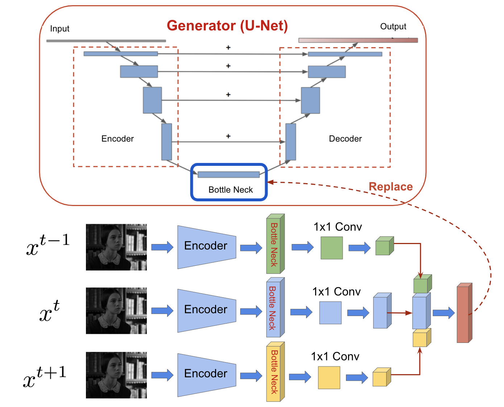
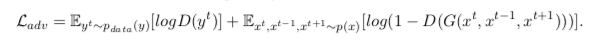
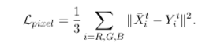
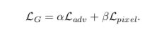

# Video-Colorization-with-GANs

[See project report]()

## Introduction
This repository is the implementation of Conditional GANs, to colorize videos from greyscale to RGB.
The input of the network is 1-channel greyscale video (specifically, the 'L' channel of LAB color space), and the Generator will create a 3-channel colorful version of the input video. 

The generator has an encoder-decoder architecture. Since we process the input video frame-by-frame, in order to achieve temporal smoothing, we feed three continuous frames at every step to get a new bottleneck feature map; the discriminator is just one encoder plus fully-connected layers which gives one-class output. Skip-connection is applied in the generator (U-Net). For 224x224 images, the architecture of generator is shown below. 

 

To stabilize the training of our GANs, we apply two additional training strategies:
1. We replace all negative log likelihood objective in the adversarial loss by a least square loss.
2. We introduce spectral normalization to stabilize the training of discriminator.

Each block contains Conv(transpose Conv) layer, BatchNormalization and Leaky ReLU. Final activation function for generator is tanh; for discriminator its sigmoid. Input images are normalized before feeding into the network. 

Therefore, the adversarial loss function is given by:

Meanwhile, the pixel-level loss is an average of RGB channels, which is given by:

The relative weight between adversarial loss and pixel-level loss is balanced by hyper-parameters, which is given by:

where the coefficient α = 1 and β = 20 is used according to experiments. The model is optimized using Adam optimizer with minor changes.

The model is universal for all kinds of colorful video dataset. Two datasets are experimented here: *Jane Eyre* and *Zootopia*. 

## Instruction

### Prepare Dataset

* [Jane Eyre](https://www.imdb.com/title/tt0116684/): We use FFmpeg to extract frames from the input video, resulting in a total of 10000 training images, and 2804 test images. 

* [Zootopia](https://www.imdb.com/title/tt2948356/): We use FFmpeg to extract frames from the input video, resulting in a total of 10000 training images, and 1330 test images. 

### Training (and validation)

* Example command to train Zootopia dataset:

`python gan_main_time.py --path my_path --batch_size 8 --lr 1e-3 --large --num_epoch 50 --lamb 20 -s --gpu 0 --ngf 64 --ndf 32 --patchGAN --use_lsgan`

Replace `my_path` by the root path of Zootopia dataset. 

Image samples created during validation will be saved in `img/`, and the model will be saved in `model/` if `-s` option is used. 

### Testing

* Example command to test Zootopia dataset:

`python output.py --path data_path/ --savepath output_time/ --modelpath model_path --time 'time'`

to test the model with unseen images. Replace `data_path` by the path of the test set of Zootopia and replace `model_path` by the path of the model that was saved during the training process.

## Result

We compare our results with baseline models in 2 ways -- individual frame quality and continuous frames quality. 

### Indivial Frame

*Jane Eyre* with 480x480 image size:

*Zootopia* with 480x480 image size:

### Continuous Frame
*Jane Eyre* with 480x480 image size:

*Zootopia* with 480x480 image size:

## Reference

* I. J. Goodfellow, J. Pouget-Abadie, M. Mirza, B. Xu,
D. Warde-Farley, S. Ozair, A. Courville, and Y. Bengio.
Generative adversarial networks. arXiv, 2014.

* M. Mirza and S. Osindero. Conditional generative adversarial
nets. CoRR, abs/1411.1784, 2014.

* O. Ronneberger, P. Fischer, and T. Brox. U-net: Convolutional
networks for biomedical image segmentation.
CoRR, abs/1505.04597, 2015.

* Han Zhang, Ian J. Goodfellow, Dimitris N. Metaxas, and Augustus Odena. Self-attention generative adversarial networks. CoRR, abs/1805.08318, 2018.

* Dmitry Ulyanov, Andrea Vedaldi, and Victor Lempitsky. Instance normalization: The missing ingredient for fast stylization. arXiv preprint arXiv:1607.08022, 2016.

* Takeru Miyato, Toshiki Kataoka, Masanori Koyama, and Yuichi Yoshida. Spectral normalization for generative adversarial networks. arXiv preprint arXiv:1802.05957, 2018.
